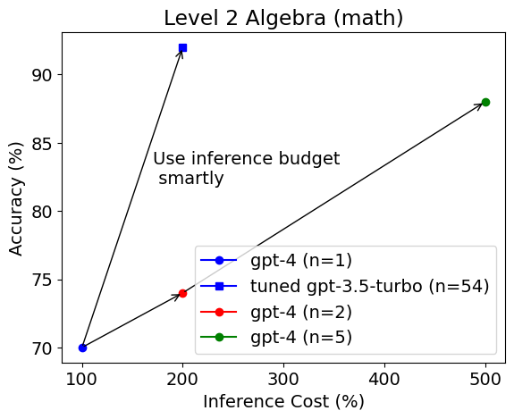
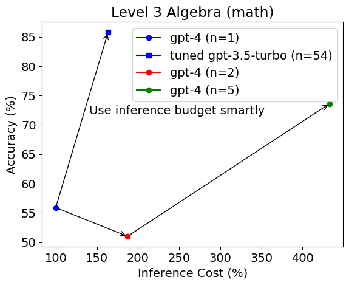
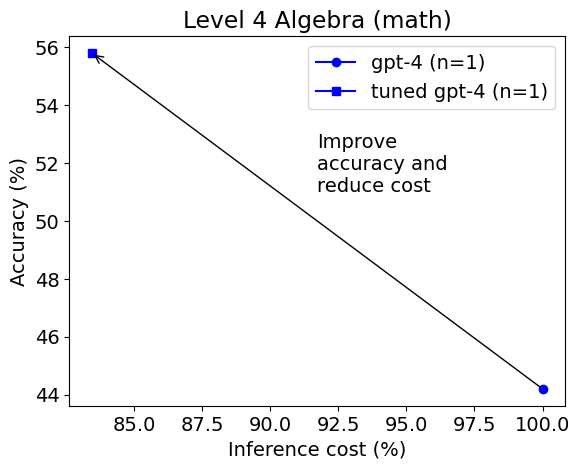
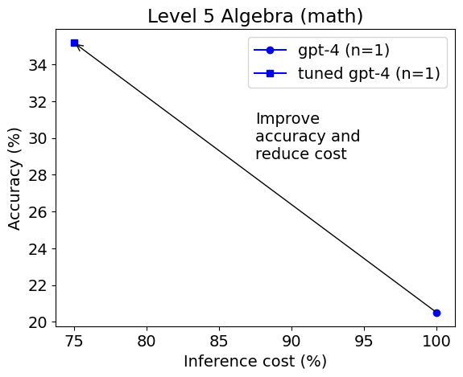

**太长不看版:**
* **仅通过调整推理参数如模型、响应数量、温度等，而不改变任何模型权重或提示，未调整的gpt-4的基线准确率可以在高中数学竞赛问题中提高20%。**
* **对于简单问题，调整后的gpt-3.5-turbo模型在准确性（例如，90%对70%）和成本效率上远远超过未调整的gpt-4。对于难题，调整后的gpt-4在准确性（例如，35%对20%）和成本上都比未调整的gpt-4要低。**
* **AutoGen可以帮助在LLM应用中进行模型选择、参数调整和节省成本。**

大型语言模型（LLM）是强大的工具，可以为各种应用生成自然语言文本，如聊天机器人、摘要、翻译等。GPT-4目前是世界上最先进的LLM。模型选择重要吗？推理参数呢？

在这篇博客文章中，我们将探讨模型和推理参数在LLM应用中的重要性，使用[MATH](https://datasets-benchmarks-proceedings.neurips.cc/paper/2021/hash/be83ab3ecd0db773eb2dc1b0a17836a1-Abstract-round2.html)案例研究，这是一个用于评估LLM在高级数学问题解决上的基准测试。MATH包含来自AMC-10、AMC-12和AIME的12K数学竞赛问题。每个问题都附有逐步解答。

我们将使用AutoGen来自动找到给定任务和数据集上LLM的最佳模型和推理参数，给定一个推理预算，使用一种新颖的低成本搜索和剪枝策略。AutoGen目前支持OpenAI的所有LLM，如GPT-3.5和GPT-4。

我们将使用AutoGen进行模型选择和推理参数调整。然后我们比较解决代数问题的性能和推理成本与未调整的gpt-4。我们还将分析不同难度级别如何影响结果。

## 实验设置

我们使用AutoGen在目标推理预算为每实例$0.02的情况下选择以下模型：
- gpt-3.5-turbo，一种相对便宜的模型，它驱动了流行的ChatGPT应用
- gpt-4，比gpt-3.5-turbo贵10倍以上的最先进LLM

我们使用训练集中的20个示例来适应模型，使用问题陈述作为输入并生成输出解答。我们使用以下推理参数：

- 温度：控制输出文本随机性的参数。更高的温度意味着更多的多样性但较少的连贯性。我们在[0, 1]范围内搜索最佳温度。
- top_p：控制输出令牌概率质量的参数。只有累积概率小于或等于top-p的令牌才被考虑。较低的top-p意味着更多的多样性但较少的连贯性。我们在[0, 1]范围内搜索最佳top-p。
- max_tokens：每个输出可以生成的最大令牌数量。我们在[50, 1000]范围内搜索最佳最大长度。
- n：生成的响应数量。我们在[1, 100]范围内搜索最佳n。
- 提示：我们使用模板：“{problem} 仔细解决问题。尽可能简化你的答案。将最终答案放在\\boxed{{}}中。”其中{problem}将被数学问题实例替换。

在这个实验中，当n > 1时，我们找到所有响应中票数最高的答案，然后选择它作为最终答案与真实值比较。例如，如果n = 5且3个响应包含最终答案301，而2个响应包含最终答案159，我们选择301作为最终答案。这可以帮助解决由于随机性导致的潜在错误。我们使用平均准确率和平均推理成本作为评估数据集性能的指标。特定实例的推理成本是通过每1K令牌的价格和消耗的令牌数量来衡量的。

## 实验结果

这篇博客文章中的第一张图显示了每种配置在二级代数测试集上的平均准确率和平均推理成本。

令人惊讶的是，调整后的gpt-3.5-turbo模型被选为更好的模型，并且在准确性上大大超过未调整的gpt-4（92%对70%），预算相等或高出2.5倍。
在三级代数测试集上也可以得到相同的观察结果。

然而，在四级代数上选择的模型发生了变化。

这次gpt-4被选为最佳模型。调整后的gpt-4在准确性（56

%对44%）和成本上都实现了比未调整的gpt-4更高的成就。
在五级上结果类似。

我们可以看到AutoGen为每个特定级别的子集找到了不同的最佳模型和推理参数，这表明这些参数在成本敏感的LLM应用中很重要，并需要仔细调整或适应。

运行这些实验的示例笔记本可以在以下链接找到：https://github.com/microsoft/FLAML/blob/v1.2.1/notebook/autogen_chatgpt.ipynb。实验是在AutoGen作为FLAML子包时进行的。

## 分析和讨论

虽然在相同推理预算下，gpt-3.5-turbo在相对容易的代数问题中展示了具有竞争力的准确性，但对于最困难的问题，gpt-4是更好的选择。总的来说，通过参数调整和模型选择，我们可以识别出在更具挑战性的任务上节省昂贵模型的机会，并提高预算有限系统的整体效果。

解决数学问题还有许多其他替代方法，我们在这篇博客文章中没有涉及。当有超出推理参数的选择时，它们通常可以通过[`flaml.tune`](https://microsoft.github.io/FLAML/docs/Use-Cases/Tune-User-Defined-Function)进行调整。

模型选择、参数调整和成本节省的需求不仅限于数学问题。[Auto-GPT](https://github.com/Significant-Gravitas/Auto-GPT)项目是一个例子，其中高成本很容易阻止一个通用复杂任务的完成，因为它需要许多LLM推理调用。

## 进一步阅读

* [关于调整技术的研究论文](https://arxiv.org/abs/2303.04673)
* [关于推理调整的文档](/docs/Use-Cases/enhanced_inference)

*您有关于LLM应用的经验分享吗？您希望看到更多关于LLM优化或自动化的支持或研究吗？请加入我们的[Discord](https://discord.gg/pAbnFJrkgZ)服务器进行讨论。*