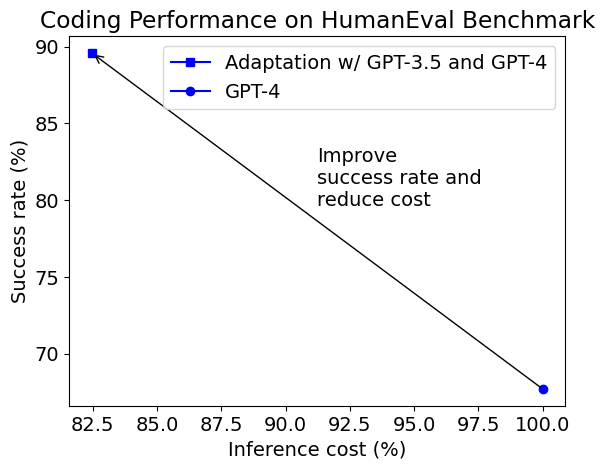
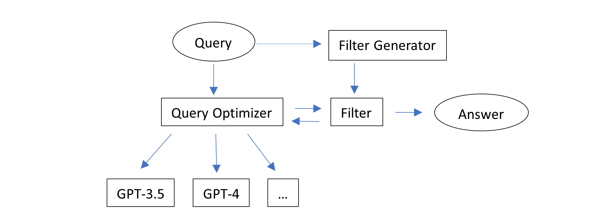

**简而言之：**
* **使用HumanEval基准测试案例研究表明，通过自适应使用多个GPT模型，可以在编码方面实现更高的准确性（从68%提高到90%）和更低的推理成本（降低18%），而不是单独使用GPT-4。**


GPT-4是基础模型能力的一个重大升级，例如在代码和数学方面，伴随着使用代价的大幅提升（超过10倍）相比于GPT-3.5-Turbo。在OpenAI开发的代码完成基准测试[HumanEval](https://huggingface.co/datasets/openai_humaneval)上，GPT-4可以成功解决68%的任务，而GPT-3.5-Turbo则为46%。通过生成多个响应或进行多次调用，可以进一步提高GPT-4的成功率。然而，这将进一步增加成本，而且API调用率限制更为严格，成本已经近乎使用GPT-3.5-Turbo的20倍。我们能否用更少的资源做到更多？

在这篇博客文章中，我们将探索一种创造性的自适应使用GPT模型的方法，这将带来一个巨大的飞跃。

## 观察

* GPT-3.5-Turbo已经可以解决40%-50%的任务。对于这些任务，如果我们从不使用GPT-4，我们可以节省近40-50%的成本。
* 如果我们使用节省下来的成本在剩余未解决的任务上用GPT-4生成更多响应，有可能在保持平均成本降低的同时解决更多任务。

利用这些观察的障碍是，我们事先不知道哪些任务可以由更便宜的模型解决，哪些任务需要更昂贵的模型解决，以及哪些任务需要支付更多给昂贵的模型。

为了克服这个障碍，人们可能想要预测哪个任务需要哪个模型来解决，以及每个任务需要多少响应。让我们看一个代码完成任务的例子：

```python
def vowels_count(s):
    """Write a function vowels_count which takes a string representing
    a word as input and returns the number of vowels in the string.
    Vowels in this case are 'a', 'e', 'i', 'o', 'u'. Here, 'y' is also a
    vowel, but only when it is at the end of the given word.

    Example:
    >>> vowels_count("abcde")
    2
    >>> vowels_count("ACEDY")
    3
    """
```

我们能预测GPT-3.5-Turbo是否能解决这个任务，还是我们需要使用GPT-4吗？我的第一反应是GPT-3.5-Turbo可以做对，因为指令相当直接。然而，事实证明，如果我们只给它一次机会，GPT-3.5-Turbo并不总是能做对。如何在不实际尝试的情况下预测性能是一个有趣的研究问题。

我们还能做什么？我们注意到：
**验证给定解决方案比从头开始找到正确解决方案“更容易”。**

文档字符串中提供了一些简单的示例测试用例。如果我们已经有了一个模型生成的响应，我们可以使用这些测试用例来过滤错误的实现，并使用更强大的模型或生成更多响应，直到结果通过示例测试用例。此外，这一步骤可以通过要求GPT-3.5-Turbo从文档字符串中给出的示例生成断言语句（一个我们可以下注的更简单的任务）并执行代码来自动化。

## 解决方案

结合这些观察，我们可以设计一个包含两个直观想法的解决方案：

* 利用自动生成的反馈，即代码执行结果，来过滤响应。
* 逐一尝试推理配置，直到一个响应能通过过滤。



这个解决方案在不知道或预测哪个任务适合哪种配置的情况下自适应工作。它简单地逐一尝试多种配置，从最便宜的配置开始。注意，一个配置可以生成多个响应（通过将推理参数n设置得大于1）。不同的配置可以使用相同的模型和不同的推理参数，例如n和温度。每个任务返回并评估一个响应。

这个解决方案的实现在[autogen](/docs/reference/code_utils#implement)中提供。它使用以下配置序列：

1. GPT-3.5-Turbo, n=1, temperature=0
2. GPT-3.5-Turbo, n=7, temperature=1, stop=["\nclass", "\ndef", "\nif", "\nprint"]
3. GPT-4, n=1, temperature=0
4. GPT-4, n=2, temperature=1, stop=["\nclass", "\ndef", "\nif", "\nprint"]
5. GPT-4, n=1, temperature=1, stop=["\nclass", "\ndef", "\nif", "\nprint"]

## 实验结果

本博客文章的第一张图显示了与默认GPT-4相比，自适应解决方案的成功率和平均推理成本。推理成本包括在我们解决方案中生成断言的成本。生成的断言并不总是正确的，通过/未通过生成断言的程序并不总是正确/错误的。尽管如此，自适应解决方案可以将成功率（文献中称为pass@1）从68%提高到90%，同时降低成本18%。

以下是一些由不同配置在投资组合中解决的函数定义示例。

1. 由GPT-3.5-Turbo, n=1, temperature=0解决的：
```python
def compare(game,guess):
    """I think we all remember that feeling when the result of some long-awaited
    event is finally known. The feelings and thoughts you have at that moment are
    definitely worth noting down and comparing.
    Your task is to determine if a person correctly guessed the results of a number of matches.
    You are given two arrays of scores and guesses of equal length, where each index shows a match.
    Return an array of the same length denoting how far off each guess was. If they have guessed correctly,
    the value is 0, and if not, the value is the absolute difference between the guess and the score.


    example:

    compare([1,2,3,4,5,1],[1,2,3,4,2,-2]) -> [0,0,0,0,3,3]
    compare([0,5,0,0,0,4],[4,1,1,0,0,-2]) -> [4,4,1,0,0,6]
    """
```
2. 由GPT-3.5-Turbo, n=7, temperature=1, stop=["\nclass", "\ndef", "\nif", "\nprint"]解决的：前面提到的`vowels_count`函数。
3. 由GPT-4, n=1, temperature=0解决的：
```python
def string_xor(a: str, b: str) -> str:
    """ Input are two strings a and b consisting only of 1s and 0s.
    Perform binary XOR on these inputs and return result also as a string.
    >>> string_xor('010', '110')
    '100'
    """
```
4. 由GPT-4, n=2, temperature=1, stop=["\nclass", "\ndef", "\nif", "\nprint"]解决的：
```python
def is_palindrome(string: str) -> bool:
    """ Test if given string is a palindrome """
    return string == string[::-1]


def make_palindrome(string: str) -> str:
    """ Find the shortest palindrome that begins with a supplied string.
    Algorithm idea is simple:
    - Find the longest postfix of supplied string that is a palindrome.
    - Append to the end of the string reverse of a string prefix that comes before the palindromic suffix.
    >>> make_palindrome('')
    ''
    >>> make_palindrome('cat')
    'catac'
    >>> make_palindrome('cata')
    'catac'
    """
```
5. 由GPT-4, n=1, temperature=1, stop=["\nclass", "\ndef", "\nif", "\nprint"]解决的：
```python
def sort_array(arr):
    """
    In this Kata, you have to sort an array of non-negative integers according to
    number of ones in their binary representation in ascending order.
    For similar number of ones, sort based on decimal value.

    It must be implemented like this:
    >>> sort_array([1, 5, 2, 3, 4]) == [1, 2, 3, 4, 5]
    >>> sort_array([-2, -3, -4, -5, -6]) == [-6, -5, -4, -3, -2]
    >>> sort_array([1, 0, 2, 3, 4]) [0, 1, 2, 3, 4]
    """
```

最后一个问题是原始定义中有错误示例测试用例的一个例子。它误导了自适应解决方案，因为一个正确的实现被认为是错误的，并且进行了更多尝试。最后一个配置返回了正确的实现，即使它没有通过自动生成的断言。这个例子表明：
* 我们的自适应解决方案具有一定程度的容错能力。
* 如果使用正确的示例测试用例，自适应解决方案的成功率和推理成本可以进一步提高。

值得注意的是，降低的推理成本是在所有任务上的摊销成本。对于每个单独的任务，成本可能比直接使用GPT-4要大或小。这是自适应解决方案的本质：对于困难任务的成本通常比简单任务的成本要高。

一个运行此实验的示例笔记本可以在以下地址找到：https://github.com/microsoft/FLAML/blob/v1.2.1/notebook/research/autogen_code.ipynb。实验是在AutoGen作为FLAML子包时进行的。

## 讨论
我们的解决方案使用[`autogen`](/docs/Use-Cases/enhanced_inference#logic-error)中提供的通用接口实现起来非常简单，但结果却非常鼓舞人心。

虽然生成断言的具体方法是特定于应用的，但主要思想在LLM操作中是通用的：
* 生成多个响应以供选择 - 特别是当选择一个好的响应比一次性生成一个好的响应更容易时。
* 考虑多种配置来生成响应 - 特别是当：
  - 模型和其他推理参数的选择影响效用成本权衡；或者
  - 不同配置有互补效应。

[之前的博客文章](/blog/2023/04/21/LLM-tuning-math)提供了这些想法在解决数学问题中也是相关的证据。
`autogen`使用一种技术[EcoOptiGen](https://arxiv.org/abs/2303.04673)来支持推理参数调整和模型选择。

在研究和开发中有许多扩展方向：
* 概括提供反馈的方式。
* 自动化优化配置的过程。
* 为不同的应用构建自适应代理。

*您觉得这种方法适用于您的用例吗？您是否有其他关于LLM应用的挑战要分享？您是否希望看到更多关于LLM优化或自动化的支持或研究？请加入我们的[Discord](https://discord.gg/pAbnFJrkgZ)服务器进行讨论。*

## 进一步阅读

* 关于`autogen`的[文档](/docs/Getting-Started)和[研究论文](https://arxiv.org/abs/2303.04673)。
* 关于数学相关研究的[博客文章](/blog/2023/04/21/LLM-tuning-math)。