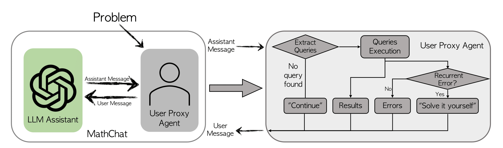
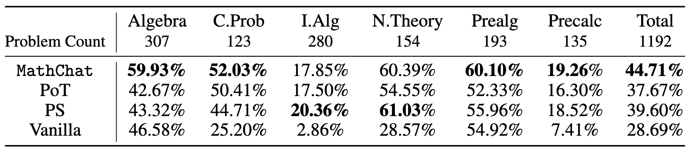

**简要总结:**
* **我们介绍了MathChat，一个利用大型语言模型（LLMs），特别是GPT-4，来解决高级数学问题的对话框架。**
* **MathChat提高了LLM在挑战性数学问题解决方面的性能，比基本提示和其他策略高出约6%。在代数类别中，准确性特别提高了15%。**
* **尽管有所进步，GPT-4在解决非常具有挑战性的数学问题上仍然存在困难，即使采用有效的提示策略。还需要进一步改进，例如开发更具体的助手模型或集成新工具和提示。**

最近的大型语言模型（LLMs），如GTP-3.5和GPT-4，在各种任务上展示了惊人的能力，例如文本生成、问题回答和代码生成。此外，这些模型可以通过对话与人类交流并记住之前的上下文，使人类更容易与它们互动。这些模型在我们日常生活中扮演着越来越重要的角色，帮助人们完成不同的任务，如写电子邮件、总结文件和编写代码。

在这篇博客文章中，我们探讨了LLMs的问题解决能力。具体来说，我们对它们解决高级数学问题的能力感兴趣，这可能代表了一类需要精确推理并且有确定性解决方案的更广泛问题。

我们介绍了MathChat，一个为了与LLMs一起解决挑战性数学问题而设计的对话框架。这个框架利用了最先进LLMs的聊天优化特性，其中用户代理和LLM助手共同努力解决数学问题。我们还测试了之前的提示技术进行比较。

## MathChat框架

MathChat模拟了LLM助手和用户代理之间的对话。顾名思义，用户代理充当用户的代理，负责与LLM助手通信并以期望的方式继续对话。

代理首先向LLM助手提出一个数学问题，由一个初始提示框架出来，指导助手如何协作解决问题。我们在初始提示中融入了现有的提示方法，如CoT（思维链）和使用工具的提示。提示的关键组成部分包括：

- **使用工具的提示：** 这指导LLM助手使用正确格式的Python代码来解决问题，允许用户代理解析代码并提供适当的结果。

- **问题解决策略选择提示：** 助手被指示选择三种潜在问题解决策略之一，包括：
  1. 编写Python程序直接解决问题。
  2. 不使用Python直接解决问题，这锻炼了LLMs的内在推理能力。
  3. 使用Python逐步解决问题。当前两种策略不适用时应使用此策略。

- **最终答案封装提示：** 这部分指导助手将最终答案放在 *\boxed*{} 中。

MathChat的提示设计灵活，可以轻松地细化以包括其他工具，如Wolfram Alpha。

让我们看一个例子，介绍**用户代理**和**LLM助手**（GPT-4）之间的对话。对话集中在如何使用Python解决不等式。
（对话已修改以便阅读。）

| 参与者 | 对话 |
|-------------|----------|
| 用户代理 | (初始提示: 让我们用Python解决一个数学问题...) 问题：找到所有满足不等式 (2x+10)(x+3) < (3x+9)(x+8) 的x。用区间表示法表达你的答案。 |
| LLM助手 | 解决这个问题的关键思路是找到临界点，这些是不等式相等的点。然后测试临界点之间的区间，找出不等式成立的区间。 |
| LLM助手（继续） | 这是找到临界点的Python代码：`from sympy import symbols, Eq, solve; x = symbols("x"); lhs = (2*x + 10)*(x + 3); rhs = (3*x + 9)*(x + 8); equation = Eq(lhs, rhs); critical_points = solve(equation, x); critical_points` |
| 用户代理 | 临界点是：[-14, -3] |
| LLM助手 | 我们发现临界点是x = -14和x = -3。现在我们将测试这些临界点之间的区间，以及临界点之前和之后的点。区间是：x < -14, -14 < x < -3, x > -3。 |
| LLM助手（继续） | 这是测试每个区间不等式的Python代码：`from sympy import symbols; x = symbols("x"); inequality = (2*x + 10)*(x + 3) < (3*x + 9)*(x + 8); test_points = [-15, -5, 0]; intervals = []; for point in test_points: if inequality.subs(x, point): intervals.append(point); intervals` |
| 用户代理 | 不等式成立的区间是测试点：[-15, 0] |
| LLM

助手 | 我们已经测试了区间并发现不等式对于：1. x < -14 (测试点：-15) 2. x > -3 (测试点：0) 是成立的。因此，不等式 (2x+10)(x+3) < (3x+9)(x+8) 的解是 x ∈ (-∞, -14) ∪ (-3, ∞) |

## 实验设置

我们评估了MathChat带来的改进。

对于实验，我们专注于MATH数据集中的5级问题，这些问题由高中竞赛问题组成。这些问题包括定理的应用和复杂方程的推导，即使对于本科生来说也是具有挑战性的。我们评估了数据集中的6个类别中的7个（几何除外）：初等代数、代数、数论、计数与概率、中级代数和预备微积分。

我们评估了GPT-4并使用了OpenAI API的默认配置。为了访问最终性能，我们手动将最终答案与正确答案进行比较。对于普通提示、程序合成和MathChat，我们让GPT-4将最终答案放在 *\boxed*{} 中，并将PoT函数的返回作为最终答案。

我们还评估了以下方法进行比较：

1. **普通提示：** 评估GPT-4的直接问题解决能力。使用的提示是：*"仔细解决问题。将最终答案放在 \boxed{} 中"*。

2. **思维程序（PoT）：** 使用零次射击PoT提示，要求模型创建一个*Solver*函数来解决问题并返回最终答案。

3. **程序合成（PS）提示：** 像PoT一样，它提示模型编写一个程序来解决问题。使用的提示是：*"编写一个程序来回答以下问题：\{问题\}"*。

## 实验结果

下面显示了使用不同方法从MATH数据集的不同类别中难度为5级的所有问题的准确性：

我们发现，与展示GPT-4内在能力的基本提示相比，将Python用于PoT或PS策略的上下文中提高了大约10%的总体准确性。这种增加主要出现在涉及更多数字操作的类别，如计数与概率和数论，以及更复杂的类别，如中级代数和预备微积分。

对于代数和初等代数等类别，PoT和PS显示出的改进很小，在某些情况下，甚至导致准确性下降。然而，MathChat能够相比PoT和PS提高总体准确性约6%，在所有类别中显示出竞争性能。值得注意的是，MathChat在代数类别中的准确性提高了约15%，超过了其他方法。注意，像中级代数和预备微积分这样的类别对所有方法来说仍然是挑战，只有大约20%的问题被准确解决。

实验的代码可以在这个[仓库](https://github.com/kevin666aa/FLAML/tree/gpt_math_solver/flaml/autogen/math)找到。
我们现在提供了使用AutoGen中的交互式代理的MathChat实现。参见这个[笔记本](https://github.com/microsoft/autogen/blob/main/notebook/agentchat_MathChat.ipynb)以了解示例用法。

## 未来方向

尽管MathChat在先前方法上有所改进，但结果显示，即使在外部工具的帮助下，复杂的数学问题对于最近强大的LLMs，如GPT-4，仍然是一个挑战。

可以进行进一步的工作来增强这个框架或一般的数学问题解决：
- 虽然使模型能够使用像Python这样的工具可以减少计算错误，但LLMs仍然容易出现逻辑错误。像自我一致性（采样多个解决方案并对最终答案进行多数投票）或自我验证（使用另一个LLM实例检查答案是否正确）的方法可能会提高性能。
- 有时，LLM能否解决问题取决于它使用的计划。一些计划需要较少的计算和逻辑推理，从而减少了错误的空间。
- MathChat有潜力被改编成一个副驾驶系统，这可以帮助用户解决数学问题。这个系统可以允许用户更多地参与解决问题的过程，可能增强学习。

## 进一步阅读

* [MathChat的研究论文](https://arxiv.org/abs/2306.01337)
* [关于`autogen`的文档](/docs/Getting-Started)

*您是否正在从事涉及数学问题解决的应用？您是否需要在LLM-based代理用于数学问题解决的应用上额外的研究或支持？请加入我们的[Discord](https://discord.gg/pAbnFJrkgZ)服务器进行讨论。*