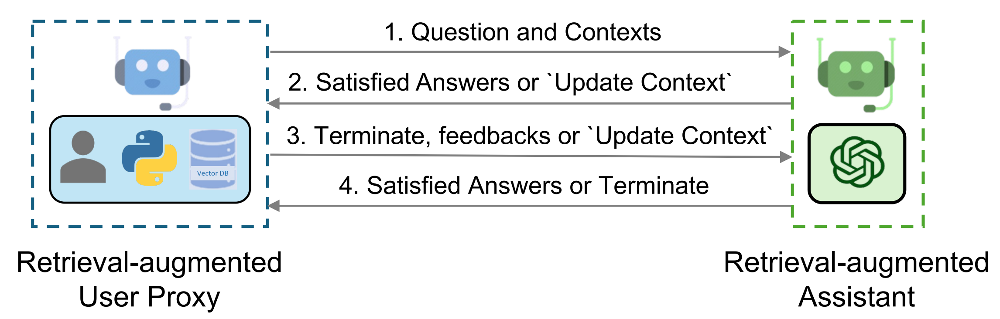
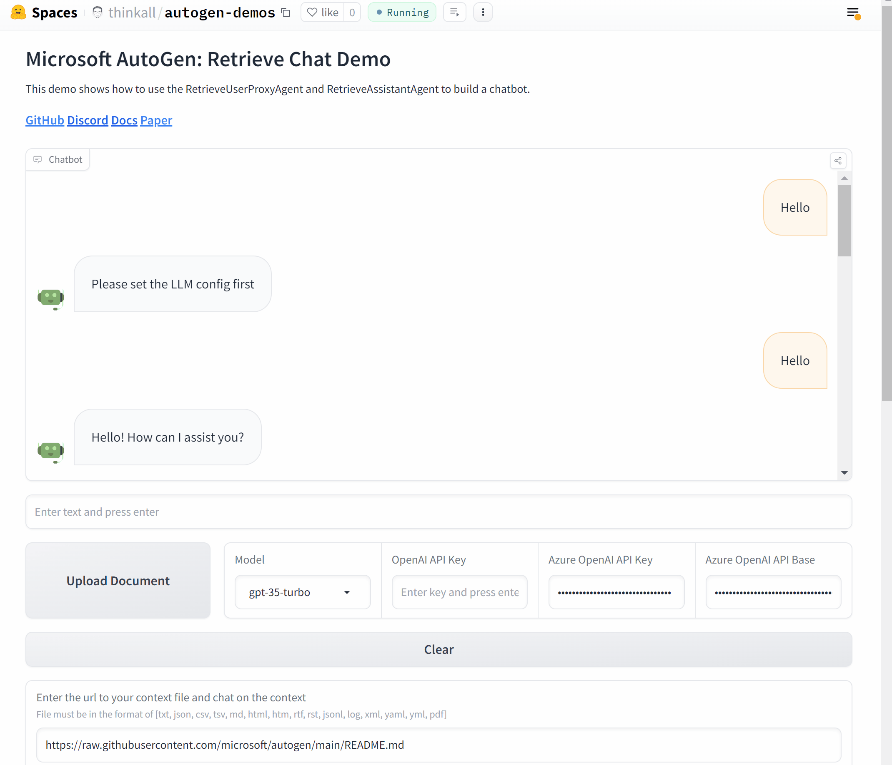

**简而言之：**
* 我们介绍了 AutoGen 的 RAG 代理 **RetrieveUserProxyAgent** 和 **RetrieveAssistantAgent**，它们允许检索增强生成及其基本用法。
* 我们展示了 RAG 代理的自定义，例如自定义嵌入函数、文本分割函数和向量数据库。
* 我们还展示了 RAG 代理的两种高级用法，包括与群聊集成和使用 Gradio 构建聊天应用程序。

## 介绍
检索增强已经成为一种实用且有效的方法，通过结合外部文档来缓解 LLM 的内在限制。在这篇博客文章中，我们介绍了允许检索增强生成的 AutoGen 的 RAG 代理。该系统由两个代理组成：一个检索增强的用户代理，称为 `RetrieveUserProxyAgent`，和一个检索增强的助手代理，称为 `RetrieveAssistantAgent`，两者都是从 AutoGen 的内置代理扩展而来。RAG 代理的整体架构如上图所示。

要使用检索增强聊天，需要初始化两个代理，包括检索增强的用户代理和检索增强的助手代理。初始化检索增强的用户代理需要指定文档集合的路径。随后，检索增强的用户代理可以下载文档，将它们分割成特定大小的块，计算嵌入，并将它们存储在向量数据库中。一旦开始聊天，代理就会根据下面概述的程序合作进行代码生成或问答：
1. 检索增强的用户代理根据嵌入相似性检索文档块，并将它们连同问题一起发送给检索增强的助手代理。
2. 检索增强的助手代理使用 LLM 根据提供的问题和上下文生成代码或文本作为答案。如果 LLM 无法产生满意的回应，它会被指示回复“更新上下文”给检索增强的用户代理。
3. 如果回应包含代码块，检索增强的用户代理执行代码并将输出作为反馈发送。如果没有代码块或指示更新上下文的指令，它终止对话。否则，它更新上下文并将问题连同新上下文一起转发给检索增强的助手代理。请注意，如果启用了人工输入请求，个人可以主动发送任何反馈，包括“更新上下文”，给检索增强的助手代理。
4. 如果检索增强的助手代理收到“更新上下文”，它会从检索增强的用户代理请求下一组最相似的文档块作为新上下文。否则，它基于反馈和聊天历史生成新的代码或文本。如果 LLM 未能生成答案，它会再次回复“更新上下文”。这个过程可以重复多次。如果没有更多的文档可用于上下文，对话就终止。

## RAG 代理的基本用法
0. 安装依赖

请在使用 RAG 代理之前安装 pyautogen 和 [retrievechat] 选项。
```bash
pip install "pyautogen[retrievechat]"
```

1. 导入代理
```python
from autogen
from autogen.agentchat.contrib.retrieve_assistant_agent import RetrieveAssistantAgent
from autogen.agentchat.contrib.retrieve_user_proxy_agent import RetrieveUserProxyAgent
```

2. 创建一个名为 "assistant" 的 'RetrieveAssistantAgent' 实例和一个名为 "ragproxyagent" 的 'RetrieveUserProxyAgent' 实例
```python
assistant = RetrieveAssistantAgent(
    name="assistant",
    system_message="You are a helpful assistant.",
    llm_config=llm_config,
)

ragproxyagent = RetrieveUserProxyAgent(
    name="ragproxyagent",
    retrieve_config={
        "task": "qa",
        "docs_path": "https://raw.githubusercontent.com/microsoft/autogen/main/README.md",
    },
)
```

3. 初始化聊天并提问
```python
assistant.reset()
ragproxyagent.initiate_chat(assistant, problem="What is autogen?")
```

输出如下：
```
--------------------------------------------------------------------------------
assistant (to ragproxyagent):

AutoGen 是一个框架，它允许使用多个可以相互对话以解决任务的代理来开发大型语言模型（LLM）应用程序。这些代理是可定制的、可对话的，并允许人类参与。他们可以在使用 LLM、人类输入和工具的组合模式下操作。

--------------------------------------------------------------------------------
```

4. 创建一个 UserProxyAgent 并提出相同的问题
```python
assistant.reset()
userproxyagent = autogen.UserProxyAgent(name="userproxyagent")
userproxyagent.initiate_chat(assistant, message="What is autogen?")
```

输出如下：
```
--------------------------------------------------------------------------------
assistant (to userproxyagent):

在计算机软件中，autogen 是一个自动生成程序代码的工具，无需手动编码。它通常用于软件工程、游戏开发和网页开发等领域，以加快开发过程并减少错误。Autogen 工具通常使用预编程的规则、模板和数据为重复任务生成代码，例如生成用户界面、数据库架构和数据模型。一些流行的 autogen 工具包括 Visual Studio 的代码生成器和 Unity 的资产商店。

--------------------------------------------------------------------------------
```

您可以看到 `UserProxyAgent` 的输出与我们的 `autogen` 无关，因为最新的 `aut

ogen` 信息不在 ChatGPT 的训练数据中。`RetrieveUserProxyAgent` 的输出是正确的，因为它可以根据给定的文档文件执行检索增强生成。

## 自定义 RAG 代理
`RetrieveUserProxyAgent` 可以通过 `retrieve_config` 进行自定义。根据不同的用例，有几个参数可以配置。在本节中，我们将展示如何自定义嵌入函数、文本分割函数和向量数据库。

### 自定义嵌入函数
默认情况下，将使用 [Sentence Transformers](https://www.sbert.net) 及其预训练模型来计算嵌入。您可能想要使用 OpenAI、Cohere、HuggingFace 或其他嵌入函数。

* OpenAI
```python
from chromadb.utils import embedding_functions

openai_ef = embedding_functions.OpenAIEmbeddingFunction(
                api_key="YOUR_API_KEY",
                model_name="text-embedding-ada-002"
            )

ragproxyagent = RetrieveUserProxyAgent(
    name="ragproxyagent",
    retrieve_config={
        "task": "qa",
        "docs_path": "https://raw.githubusercontent.com/microsoft/autogen/main/README.md",
        "embedding_function": openai_ef,
    },
)
```

* HuggingFace
```python
huggingface_ef = embedding_functions.HuggingFaceEmbeddingFunction(
    api_key="YOUR_API_KEY",
    model_name="sentence-transformers/all-MiniLM-L6-v2"
)
```

更多示例可以在[这里](https://docs.trychroma.com/embeddings)找到。

### 自定义文本分割函数
在我们将文档存储到向量数据库之前，我们需要将文本分割成块。尽管我们在 autogen 中实现了一个灵活的文本分割器，您可能仍然想要使用不同的文本分割器。还有一些现有的文本分割工具可以重用。

例如，您可以使用 langchain 中的所有文本分割器。

```python
from langchain.text_splitter import RecursiveCharacterTextSplitter

recur_spliter = RecursiveCharacterTextSplitter(separators=["\n", "\r", "\t"])

ragproxyagent = RetrieveUserProxyAgent(
    name="ragproxyagent",
    retrieve_config={
        "task": "qa",
        "docs_path": "https://raw.githubusercontent.com/microsoft/autogen/main/README.md",
        "custom_text_split_function": recur_spliter.split_text,
    },
)
```

### 自定义向量数据库
我们使用 chromadb 作为默认的向量数据库，您也可以通过简单地覆盖 `RetrieveUserProxyAgent` 的 `retrieve_docs` 函数来替换它。

例如，您可以使用 Qdrant 如下：

```python
# 创建 qdrant 客户端
from qdrant_client import QdrantClient

client = QdrantClient(url="***", api_key="***")

# 包装 RetrieveUserProxyAgent
from litellm import embedding as test_embedding
from autogen.agentchat.contrib.retrieve_user_proxy_agent import RetrieveUserProxyAgent
from qdrant_client.models import SearchRequest, Filter, FieldCondition, MatchText

class QdrantRetrieveUserProxyAgent(RetrieveUserProxyAgent):
    def query_vector_db(
        self,
        query_texts: List[str],
        n_results: int = 10,
        search_string: str = "",
        **kwargs,
    ) -> Dict[str, Union[List[str], List[List[str]]]]:
        # 在这里定义您自己的查询函数
        embed_response = test_embedding('text-embedding-ada-002', input=query_texts)

        all_embeddings: List[List[float]] = []

        for item in embed_response['data']:
            all_embeddings.append(item['embedding'])

        search_queries: List[SearchRequest] = []

        for embedding in all_embeddings:
            search_queries.append(
                SearchRequest(
                    vector=embedding,
                    filter=Filter(
                        must=[
                            FieldCondition(
                                key="page_content",
                                match=MatchText(
                                    text=search_string,
                                )
                            )
                        ]
                    ),
                    limit=n_results,
                    with_payload=True,
                )
            )

        search_response = client.search_batch(
            collection_name="{your collection name}",
            requests=search_queries,
        )

        return {
            "ids": [[scored_point.id for scored_point in batch] for batch in search_response],
            "documents": [[scored_point.payload.get('page_content', '') for scored_point in batch] for batch in search_response],
            "metadatas": [[scored_point.payload.get('metadata', {}) for scored_point in batch] for batch in search_response]
        }

    def retrieve_docs(self, problem: str, n_results: int = 20, search_string: str = "", **kwargs):
        results = self.query_vector_db(
            query_texts=[problem],
            n_results=n_results,
            search_string=search_string,
            **kwargs,
        )

        self._results = results


# 使用 QdrantRetrieveUserProxyAgent
qdrantragagent = QdrantRetrieveUserProxyAgent(
    name="ragproxyagent",
    human_input_mode="NEVER",
    max_consecutive_auto_reply=2,
    retrieve_config={
        "task": "qa",
    },
)

qdrantragagent.retrieve_docs("What is Autogen?", n_results=10, search_string="autogen")
```
## RAG代理的高级使用方法
### 在群聊中与其他代理集成
在群聊中使用`RetrieveUserProxyAgent`与在两个代理的聊天中使用它几乎相同。唯一的区别是你需要用`RetrieveUserProxyAgent`**初始化聊天**。在群聊中不需要`RetrieveAssistantAgent`。

然而，在某些情况下，你可能想要用另一个代理初始化聊天。为了充分利用`RetrieveUserProxyAgent`的优势，你需要从一个函数中调用它。

```python
llm_config = {
    "functions": [
        {
            "name": "retrieve_content",
            "description": "retrieve content for code generation and question answering.",
            "parameters": {
                "type": "object",
                "properties": {
                    "message": {
                        "type": "string",
                        "description": "Refined message which keeps the original meaning and can be used to retrieve content for code generation and question answering.",
                    }
                },
                "required": ["message"],
            },
        },
    ],
    "config_list": config_list,
    "timeout": 60,
    "seed": 42,
}

boss = autogen.UserProxyAgent(
    name="Boss",
    is_termination_msg=termination_msg,
    human_input_mode="TERMINATE",
    system_message="The boss who ask questions and give tasks.",
)

boss_aid = RetrieveUserProxyAgent(
    name="Boss_Assistant",
    is_termination_msg=termination_msg,
    system_message="Assistant who has extra content retrieval power for solving difficult problems.",
    human_input_mode="NEVER",
    max_consecutive_auto_reply=3,
    retrieve_config={
        "task": "qa",
    },
    code_execution_config=False,  # we don't want to execute code in this case.
)

coder = AssistantAgent(
    name="Senior_Python_Engineer",
    is_termination_msg=termination_msg,
    system_message="You are a senior python engineer. Reply `TERMINATE` in the end when everything is done.",
    llm_config=llm_config,
)

pm = autogen.AssistantAgent(
    name="Product_Manager",
    is_termination_msg=termination_msg,
    system_message="You are a product manager. Reply `TERMINATE` in the end when everything is done.",
    llm_config=llm_config,
)

reviewer = autogen.AssistantAgent(
    name="Code_Reviewer",
    is_termination_msg=termination_msg,
    system_message="You are a code reviewer. Reply `TERMINATE` in the end when everything is done.",
    llm_config=llm_config,
)

def retrieve_content(message, n_results=3):
        boss_aid.n_results = n_results  # Set the number of results to be retrieved.
        # Check if we need to update the context.
        update_context_case1, update_context_case2 = boss_aid._check_update_context(message)
        if (update_context_case1 or update_context_case2) and boss_aid.update_context:
            boss_aid.problem = message if not hasattr(boss_aid, "problem") else boss_aid.problem
            _, ret_msg = boss_aid._generate_retrieve_user_reply(message)
        else:
            ret_msg = boss_aid.generate_init_message(message, n_results=n_results)
        return ret_msg if ret_msg else message

for agent in [boss, coder, pm, reviewer]:
    # register functions for all agents.
    agent.register_function(
        function_map={
            "retrieve_content": retrieve_content,
        }
    )

groupchat = autogen.GroupChat(
    agents=[boss, coder, pm, reviewer], messages=[], max_round=12
)
manager = autogen.GroupChatManager(groupchat=groupchat, llm_config=llm_config)

# Start chatting with boss as this is the user proxy agent.
boss.initiate_chat(
    manager,
    message="How to use spark for parallel training in FLAML? Give me sample code.",
)
```

### 使用Gradio构建聊天应用
现在，让我们总结一下并用AutoGen和Gradio制作一个聊天应用。



```python
# 初始化代理
def initialize_agents(config_list, docs_path=None):
    ...
    return assistant, ragproxyagent

# 初始化聊天
def initiate_chat(config_list, problem, queue, n_results=3):
    ...
    assistant.reset()
    try:
        ragproxyagent.a_initiate_chat(
            assistant, problem=problem, silent=False, n_results=n_results
        )
        messages = ragproxyagent.chat_messages
        messages = [messages[k] for k in messages.keys()][0]
        messages = [m["content"] for m in messages if m["role"] == "user"]
        print("messages: ", messages)
    except Exception as e:
        messages = [str(e)]
    queue.put(messages)

# 将AutoGen部分包装成一个函数
def chatbot_reply(input_text):
    """通过终端与代理聊天。"""
    queue = mp.Queue()
    process = mp.Process(
        target=initiate_chat,
        args=(config_list, input_text, queue),
    )
    process.start()
    try:
        messages = queue.get(timeout=TIMEOUT)
    except Exception as e:
        messages = [str(e) if len(str(e)) > 0 else "Invalid Request to OpenAI, please check your API keys."]
    finally:
        try:
            process.terminate()
        except:
            pass
    return messages

...

# 使用Gradio设置UI
with gr.Blocks() as demo:
    ...
    assistant, ragproxyagent = initialize_agents(config_list)

    chatbot = gr.Chatbot(
        [],
        elem_id="chatbot",
        bubble_full_width=False,
        avatar_images=(None, (os.path.join(os.path.dirname(__file__), "autogen.png"))),
        # height=600,
    )

    txt_input = gr.Textbox(
        scale=4,
        show_label=False,
        placeholder="Enter text and press enter",
        container=False,
    )

    with gr.Row():
        txt_model = gr.Dropdown(
            label="Model",
            choices=[
                "gpt-4",
                "gpt-35-turbo",
                "gpt-3.5-turbo",
            ],
            allow_custom_value=True,
            value="gpt-35-turbo",
            container=True,
        )
        txt_oai_key = gr.Textbox(
            label="OpenAI API Key",
            placeholder="Enter key and press enter",
            max_lines=1,
            show_label=True,
            value=os.environ.get("OPENAI_API_KEY", ""),
            container=True,
            type="password",
        )
        ...

    clear = gr.ClearButton([txt_input, chatbot])

...

if __name__ == "__main__":
    demo.launch(share=True)
```

在线应用和源代码托管在[HuggingFace](https://huggingface.co/spaces/think

all/autogen-demos)。欢迎尝试！

## 阅读更多
你可以查看更多RAG使用案例的示例笔记本：
- [使用检索增强代理进行自动代码生成和问题回答](https://github.com/microsoft/autogen/blob/main/notebook/agentchat_RetrieveChat.ipynb)
- [使用检索增强生成的群聊（包含5个群成员代理和1个管理代理）](https://github.com/microsoft/autogen/blob/main/notebook/agentchat_groupchat_RAG.ipynb)