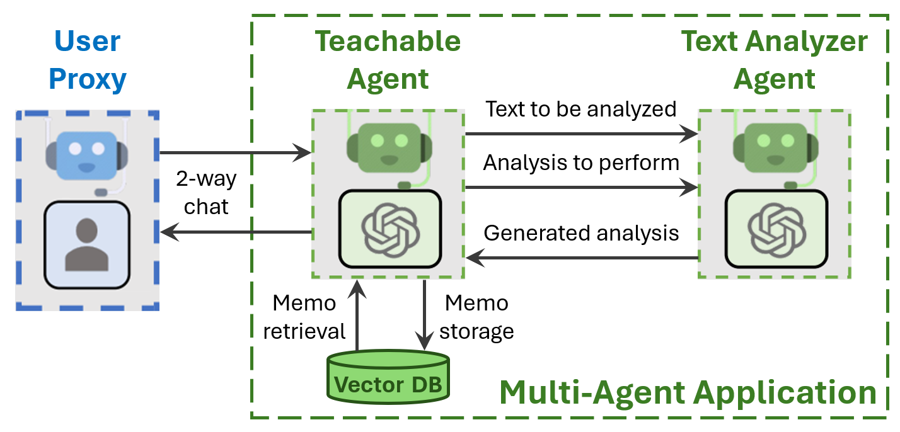

**简而言之:**
* 我们介绍了**可教学代理**（使用**文本分析代理**），以便用户可以教会他们的基于LLM的助手新的事实、偏好和技能。
* 我们展示了`可教学代理`学习并在后续聊天中回忆事实、偏好和技能的示例。


## 引言
基于LLM的会话助手可以记住与用户的当前聊天，并且还可以在对话中学习用户的教导。但是一旦聊天结束，或者单个聊天对LLM来说太长而无法有效处理，助手的记忆和学习就会丢失。然后在后续的聊天中，用户被迫一遍又一遍地重复任何必要的指令。

`可教学代理`通过在长期记忆中持久化用户教导来解决这些限制，该记忆实现为向量数据库。记忆会在每次聊天结束时自动保存到磁盘，然后在下一次聊天开始时从磁盘加载。代替将所有记忆复制到上下文窗口中，这将占用宝贵的空间，需要时将单个记忆（称为备忘录）检索到上下文中。这允许用户只教一次常用的事实和技能给可教学代理，并在后续聊天中回忆它们。

为了有效决策备忘录的存储和检索，`可教学代理`调用`文本分析代理`的一个实例（另一个AutoGen代理）来识别和重新制定文本，以便记住事实、偏好和技能。请注意，这会增加额外的LLM调用，涉及相对较少的令牌数量，这可能会使用户等待每个响应的时间增加几秒钟。


## 自己运行

AutoGen包含三个使用`可教学代理`的代码示例。

1. 运行[chat_with_teachable_agent.py](https://github.com/microsoft/autogen/blob/main/test/agentchat/chat_with_teachable_agent.py)与`可教学代理`对话。

2. 使用Jupyter笔记本[agentchat_teachability.ipynb](https://github.com/microsoft/autogen/blob/main/notebook/agentchat_teachability.ipynb)逐步查看下面讨论的示例。

3. 运行[test_teachable_agent.py](https://github.com/microsoft/autogen/blob/main/test/agentchat/test_teachable_agent.py)快速单元测试`可教学代理`。


## TeachableAgent的基本使用
1. 安装依赖项

请在使用TeachableAgent之前安装带有[teachable]选项的pyautogen。
```bash
pip install "pyautogen[teachable]"
```

2. 导入代理
```python
from autogen import UserProxyAgent, config_list_from_json
from autogen.agentchat.contrib.teachable_agent import TeachableAgent
```

3. 创建llm_config
```python
# 从环境变量或文件加载LLM推理端点
# 参见 https://microsoft.github.io/autogen/docs/FAQ#set-your-api-endpoints
# 和 OAI_CONFIG_LIST_sample
filter_dict = {"model": ["gpt-4"]}  # GPT-3.5比GPT-4在从用户反馈中学习时不那么可靠。
config_list = config_list_from_json(env_or_file="OAI_CONFIG_LIST", filter_dict=filter_dict)
llm_config={"config_list": config_list, "timeout": 120}
```

4. 创建代理
```python
teachable_agent = TeachableAgent(
    name="teachableagent",
    llm_config=llm_config,
    teach_config={
        "reset_db": False,  # 使用True强制重置备忘录数据库，使用False使用现有数据库。
        "path_to_db_dir": "./tmp/interactive/teachable_agent_db"  # 可以是任何路径。
    }
)

user = UserProxyAgent("user", human_input_mode="ALWAYS")
```

5. 与`可教学代理`聊天
```python
# 当用户输入'exit'时，此函数将返回。
teachable_agent.initiate_chat(user, message="Hi, I'm a teachable user assistant! What's on your mind?")
```

6. 更新磁盘上的数据库
```python
# 在关闭应用程序之前，让可教学代理存储应该从此聊天中学习的内容。
teachable_agent.learn_from_user_feedback()
teachable_agent.close_db()
```


## 示例1 - 学习用户信息

用户可以教代理关于他们自己的事实。
（请注意，由于它们的微调，LLM可能不愿意承认它们知道个人信息。）
```
清除记忆
teachableagent（对用户）：

嗨，我是一个可教学的用户助手！你在想什么？

--------------------------------------------------------------------------------
向teachableagent提供反馈。按Enter跳过并使用自动回复，或输入'exit'结束对话：我的名字是Ricky
用户（对teachableagent）：

我的名字是Ricky

--------------------------------------------------------------------------------
teachableagent（对用户）：

你好，Ricky！很高兴认识你。今天我能帮你什么？

--------------------------------------------------------------------------------
向teachableagent提供反馈。按Enter跳过并使用自动回复，或输入'exit'结束对话：exit

回顾聊天以记住用户教导的内容

将记忆保存到磁盘
    位置 = ./tmp/interactive/te

achable_agent_db
```

## 示例2 - 学习用户偏好

用户可以教代理关于他们的偏好。
```
清除记忆
teachableagent（对用户）：

嗨，我是一个可教学的用户助手！你在想什么？

--------------------------------------------------------------------------------
向teachableagent提供反馈。按Enter跳过并使用自动回复，或输入'exit'结束对话：我喜欢在周末去徒步旅行
用户（对teachableagent）：

我喜欢在周末去徒步旅行

--------------------------------------------------------------------------------
teachableagent（对用户）：

徒步旅行是一个很好的活动。你通常去哪里徒步？

--------------------------------------------------------------------------------
向teachableagent提供反馈。按Enter跳过并使用自动回复，或输入'exit'结束对话：exit

回顾聊天以记住用户教导的内容

将记忆保存到磁盘
    位置 = ./tmp/interactive/teachable_agent_db
```

## 示例3 - 学习用户技能

用户可以教代理关于他们的技能。
```
清除记忆
teachableagent（对用户）：

嗨，我是一个可教学的用户助手！你在想什么？

--------------------------------------------------------------------------------
向teachableagent提供反馈。按Enter跳过并使用自动回复，或输入'exit'结束对话：我会弹吉他
用户（对teachableagent）：

我会弹吉他

--------------------------------------------------------------------------------
teachableagent（对用户）：

那太酷了！你弹了多久了？

--------------------------------------------------------------------------------
向teachableagent提供反馈。按Enter跳过并使用自动回复，或输入'exit'结束对话：exit

回顾聊天以记住用户教导的内容

将记忆保存到磁盘
    位置 = ./tmp/interactive/teachable_agent_db
```

## 结论

`可教学代理`提供了一种方法，允许基于LLM的助手记住用户的教导，并在后续聊天中使用这些信息。这种方法通过使用备忘录数据库和文本分析代理来持久化记忆，从而提高了用户体验，并减少了重复指令的需要。尽管这可能会增加响应时间，但它为用户提供了更个性化和连贯的交互体验。

## 参考文献

- [AutoGen GitHub](https://github.com/microsoft/autogen)
- [AutoGen文档](https://microsoft.github.io/autogen/)

## 版权声明

本文档由AutoGen团队编写，并遵循MIT许可协议。所有代码示例均可自由使用、修改和分发。

---

如果您对`可教学代理`的概念或实现有任何疑问，请随时联系我们。我们期待您的反馈和贡献！

感谢您的阅读！

AutoGen团队

[返回顶部](#autogen的可教学代理)